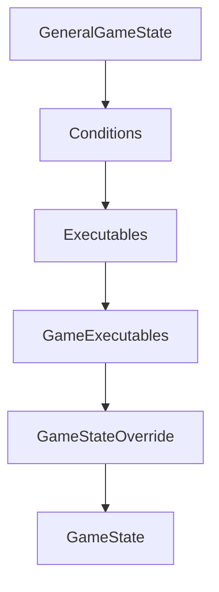

`GameState` is the central object that runs a single simulation round. It owns the current board, win data, event book, and all per-spin mutable state. Every game you build subclasses `GameState` (or its parent chain) and implements `run_spin()` as the simulation entry point.

## Class hierarchy



| Class | Module | Role |
|-------|--------|------|
| `GeneralGameState` | `src/state/state.py` | Abstract base. Owns all state, manages books and win manager. |
| `Conditions` | `src/state/state_conditions.py` | Query helpers (`in_criteria`, `is_wincap`, `is_in_gametype`). |
| `Executables` | `src/executables/executables.py` | Reusable spin actions (draw board, free spins, win cap, global multiplier). |
| `GameExecutables` | `game_executables.py` (per game) | Game-specific win evaluation and custom actions. |
| `GameStateOverride` | `game_override.py` (per game) | Override `reset_book()`, define `assign_special_sym_function()`. |
| `GameState` | `gamestate.py` (per game) | Implements `run_spin()` and `run_freespin()`. |

## GameState properties

<ResponseField name="board" type="list[list[Symbol]]">
  The active board after the most recent `draw_board()` call. Indexed as `board[reel][row]`. Each entry is a `Symbol` object with a `.name` attribute and any special properties set by `assign_special_sym_function`.
</ResponseField>

<ResponseField name="gametype" type="string">
  Current game phase. Starts as `config.basegame_type` (default `"basegame"`) and switches to `config.freegame_type` (default `"freegame"`) when `reset_fs_spin()` is called.
</ResponseField>

<ResponseField name="repeat" type="bool">
  Controls the simulation retry loop in `run_spin()`. Set to `True` before the loop begins; reset to `False` by `reset_book()`. Set back to `True` by `check_repeat()` when distribution criteria are not satisfied.
</ResponseField>

<ResponseField name="win_data" type="dict">
  Populated by the win evaluation step each spin. Structure:

  ```json
  {
    "totalWin": 0.5,
    "wins": [
      {
        "symbol": "H1",
        "kind": 4,
        "win": 0.5,
        "positions": [{"reel": 0, "row": 1}, ...],
        "meta": {}
      }
    ]
  }
  ```
</ResponseField>

<ResponseField name="win_manager" type="WinManager">
  Tracks cumulative, spin, base-game, and free-game win amounts. Updated via `win_manager.update_spinwin()` and `win_manager.update_gametype_wins()`.
</ResponseField>

<ResponseField name="config" type="GameConfig">
  Reference to the `GameConfig` instance passed at construction. Read-only during simulation.
</ResponseField>

<ResponseField name="fs" type="int">
  Current free spin index (0-based). Incremented by `update_freespin()` at the start of each free spin.
</ResponseField>

<ResponseField name="tot_fs" type="int">
  Total free spins awarded this round (including retriggers). Set by `update_freespin_amount()` and incremented by `update_fs_retrigger_amt()`.
</ResponseField>

<ResponseField name="book" type="Book">
  Stores all events emitted during the current simulation. Passed to `imprint_wins()` at the end of the round to persist it in the library.
</ResponseField>

<ResponseField name="global_multiplier" type="int">
  Running global multiplier value, starting at `1`. Incremented by `update_global_mult()`.
</ResponseField>

<ResponseField name="wincap_triggered" type="bool">
  Set to `True` by `evaluate_wincap()` when the running win reaches `config.wincap`. Prevents further win events from being emitted.
</ResponseField>

<ResponseField name="criteria" type="string">
  The distribution criteria label assigned to the current simulation number (e.g. `"basegame"`, `"freegame"`, `"winCap"`). Assigned by the simulation runner before `run_spin()` is called.
</ResponseField>

## Key methods

### reset_seed(sim)

```python
def reset_seed(self, sim: int = 0, seed_override=None) -> None
```

Seeds the Python `random` module with `sim + 1`. Call this as the first line of `run_spin()` so that every simulation number is fully reproducible.

### reset_book()

```python
def reset_book(self) -> None
```

Resets all per-spin state: clears the board, creates a new `Book`, zeroes `win_data`, resets `win_manager`, sets `repeat = False`, resets `fs`, `tot_fs`, `global_multiplier`, and `wincap_triggered`. Call this at the start of each retry loop iteration.

### check_repeat()

```python
def check_repeat(self) -> None
```

Checks whether the completed simulation satisfies the active distribution's `win_criteria` and `force_freegame` constraints. Sets `self.repeat = True` if any constraint fails. Call this at the end of the spin loop, after `evaluate_finalwin()`.

### imprint_wins()

```python
def imprint_wins(self) -> None
```

Saves the completed simulation to `self.library` and flushes `temp_wins` (recorded events) to `self.recorded_events`. Call this once after the retry loop exits.

### update_final_win()

```python
def update_final_win(self) -> None
```

Computes the final payout multiplier (clamped to `wincap`), splits it into base-game and free-game portions, and writes values onto `self.book`. Raises `AssertionError` if base + free game wins do not match the total. Called inside `evaluate_finalwin()`.

### record(description)

```python
def record(self, description: dict) -> None
```

Appends an event descriptor to `temp_wins` for tracking distributions. Typically called when a free spin trigger or other trackable event occurs:

```python
self.record({
    "kind": self.count_special_symbols("scatter"),
    "symbol": "scatter",
    "gametype": self.gametype,
})
```

Data is written to the `force/` output files and consumed by the optimization algorithm to identify which simulations belong to which event type.

## run_spin() — simulation entry point

`run_spin(sim, simulation_seed=None)` is an abstract method in `GeneralGameState` that you must implement in your `GameState` class. The simulation runner calls it once per simulation number.

```python gamestate.py
def run_spin(self, sim, simulation_seed=None):
    self.reset_seed(sim)          # seed RNG for reproducibility
    self.repeat = True
    while self.repeat:
        self.reset_book()         # clear per-spin state
        self.draw_board()         # draw from reel strips

        # 1. Evaluate win_data for the current board
        # 2. Update win_manager with the spin win
        # 3. Emit reveal and winInfo events

        self.win_manager.update_gametype_wins(self.gametype)

        if self.check_fs_condition():
            self.run_freespin_from_base()

        self.evaluate_finalwin()  # compute payout multiplier
        self.check_repeat()       # verify distribution criteria

    self.imprint_wins()           # persist to library
```

Each iteration of the `while self.repeat` loop is a complete spin attempt. `reset_book()` resets `repeat` to `False`; `check_repeat()` sets it back to `True` only if a constraint is violated. The loop continues until the spin satisfies all distribution criteria.

## run_freespin()

Also abstract. Implement alongside `run_spin()` for games with free spin features:

```python gamestate.py
def run_freespin(self):
    self.reset_fs_spin()                   # switch gametype to freegame
    while self.fs < self.tot_fs:
        self.update_freespin()             # emit updateFreeSpin event, advance fs counter
        self.draw_board()                  # draw using freegame reel weights

        # evaluate wins, update win_manager, emit events

        if self.check_fs_condition():      # retrigger check
            self.update_fs_retrigger_amt()

        self.win_manager.update_gametype_wins(self.gametype)

    self.end_freespin()                    # emit freeSpinEnd event
```

## create_books()

```python src/state/run_sims.py
from src.state.run_sims import create_books

create_books(
    gamestate,
    config,
    num_sim_args,
    batch_size,
    threads,
    compress,
    profiling,
)
```

The main simulation driver. Allocates distribution criteria to simulation numbers, launches multi-threaded workers, and writes all output files.

<ResponseField name="gamestate" type="GameState">
  Instantiated `GameState` object.
</ResponseField>

<ResponseField name="config" type="GameConfig">
  The game configuration object.
</ResponseField>

<ResponseField name="num_sim_args" type="dict">
  Maps bet mode names to simulation counts: `{"base": 1000000, "bonus": 100000}`.
</ResponseField>

<ResponseField name="batch_size" type="int">
  Number of simulations per thread batch. Typical value: `50000`.
</ResponseField>

<ResponseField name="threads" type="int">
  Number of parallel worker processes.
</ResponseField>

<ResponseField name="compress" type="bool">
  When `True`, output books are written as `.jsonl.zst` (Zstandard compressed). When `False`, plain `.jsonl` files are written — useful during development.
</ResponseField>

<ResponseField name="profiling" type="bool">
  When `True`, runs a single-threaded cProfile pass and generates a flame graph. `threads` must equal `1` when profiling.
</ResponseField>

<Note>
  `num_sim_args` values must satisfy `n % (threads × batch_size) == 0` when `n > batch_size²`. Set any mode's value to `0` to skip it during a run.
</Note>

## generate_configs()

```python src/write_data/write_configs.py
from src.write_data.write_configs import generate_configs

generate_configs(gamestate)
```

Produces all configuration files required by the RGS and frontend after simulations complete:

| File | Purpose |
|------|---------|
| `config_fe_<game_id>.json` | Frontend config: symbol list, bet modes, reel strips, paylines. |
| `config_be_<game_id>.json` | Backend config: file hashes, RTP, denominations, book shelf layout. |
| `math_config.json` | Optimization algorithm input: RTP targets, fence conditions, scaling rules. |
| `manifest.json` | RGS manifest listing all published files and their S3/CDN paths. |

Call `generate_configs()` once after `create_books()` completes:

```python run.py
if __name__ == "__main__":
    config = GameConfig()
    gamestate = GameState(config)

    create_books(gamestate, config, num_sim_args, batch_size, threads, compress, profiling)
    generate_configs(gamestate)
```
